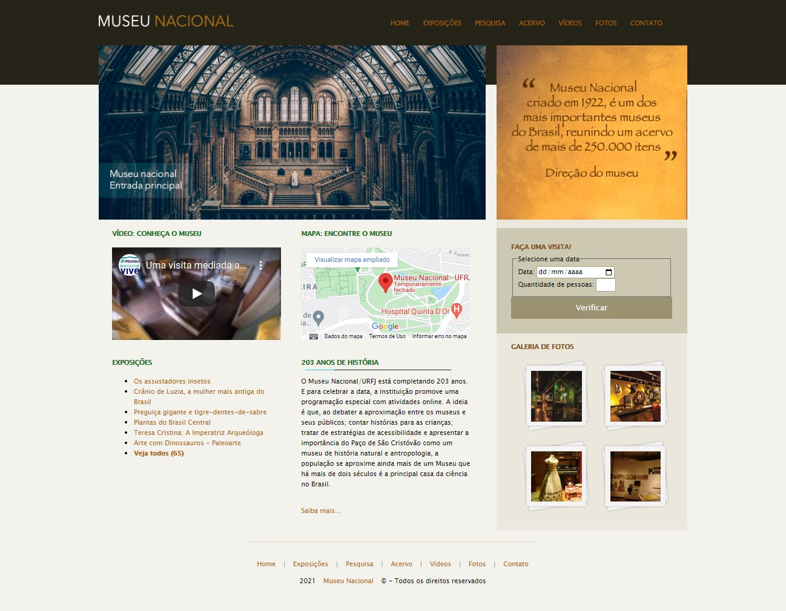
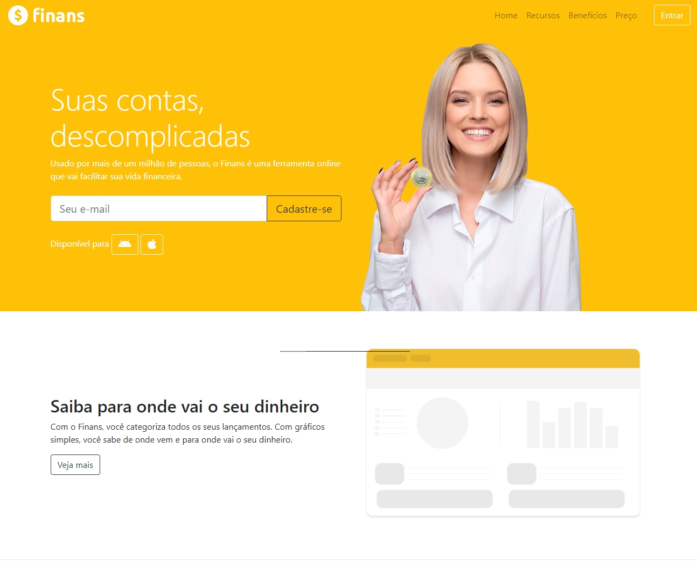
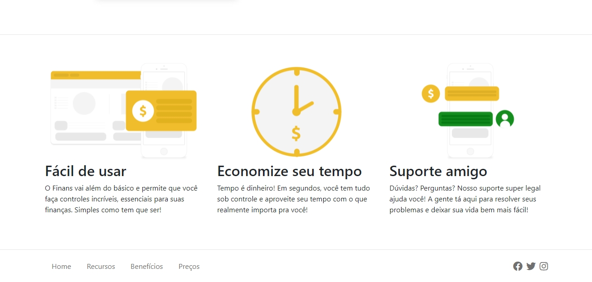
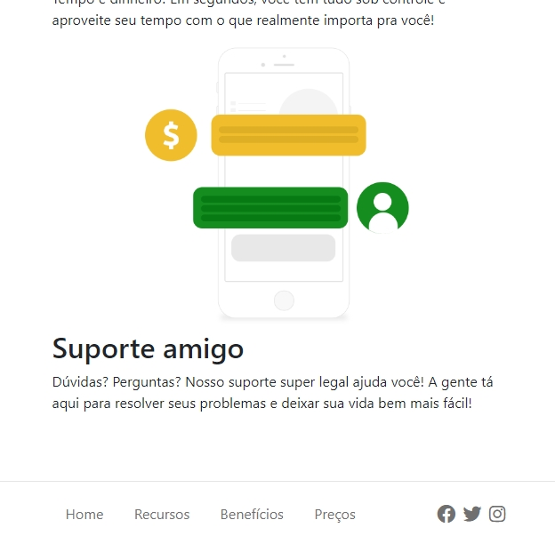

<h1>Curso-Udemy</h1>

<h2>💻 Sobre</h2>

Esse repositório é utilizado para salvar e manter meu progresso no curso de desenvolvedor web da Udemy (https://www.udemy.com/course/web-completo/).
Aqui estão alguns dos últimos projetos que desenvolvi com as aulas:

---

<h2>🔎 Projeto Museu Nacional</h2>

O projeto é sobre o Museu Nacional, que fica na Universidade Federal do Rio de Janeiro (UFRJ). É um sistema que utiliza elementos flutuantes para organização, além de links externos, como o do Google Maps e o Youtube. 

<h3 align="center">Página Inicial:</h3>

---

<h2>💵 Projeto Finans</h2>

O Finans é um site sobre uma ferramenta 
fictícia de finanças. Feito com Bootstrap,
utiliza o sistema de grids do próprio Bootstrap
e consegue ser responsivo, mostrando ou ocultando colunas
conforme a resolução da tela.

 

<h3 align="center">Página Inicial (tela cheia):</h3>

 

<h3 align="center">Rodapé (tela cheia):</h3>

 

<h3 align="center">Página Inicial (reduzida)</h3>

A página inicial foi dividida em duas colunas, e quando
a tela é menor, a foto da mulher é ocultada para melhor
visualização.

 

<h3 align="center">Rodapé (reduzido)</h3>

A última parte de conteúdo antes do rodapé foi dividido
em três colunas, e quando a tela é reduzida essas colunas
se desfazem para melhor visualização.

