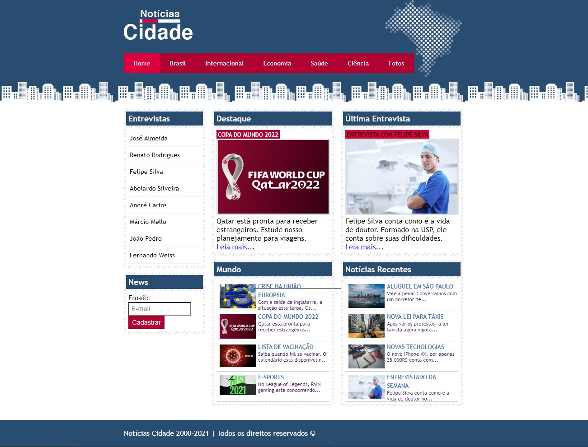
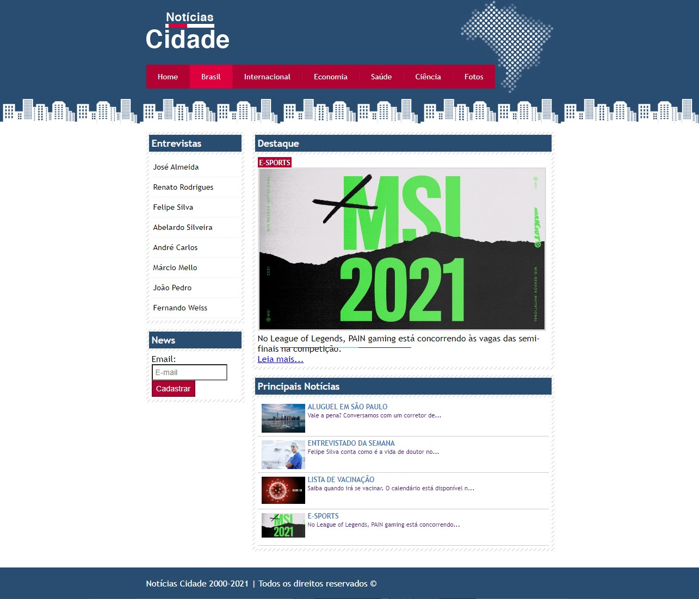
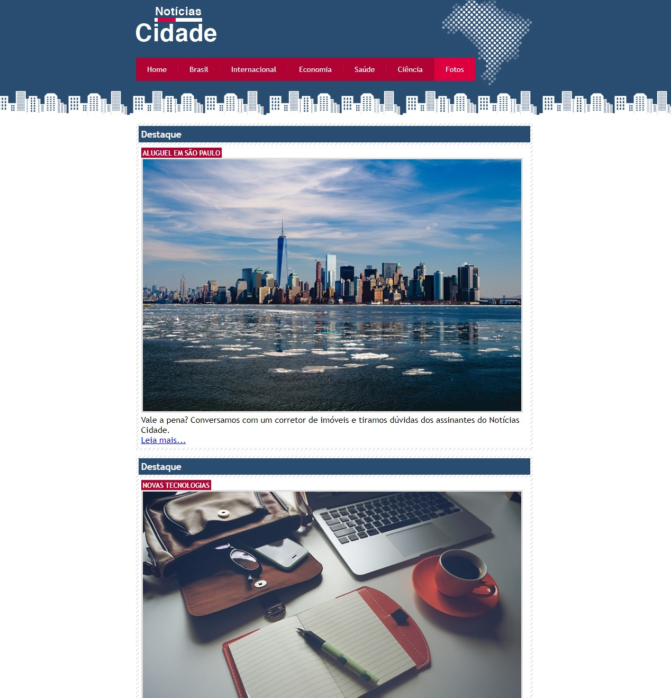

<h1>Curso-Udemy</h1>

<h2>💻 Sobre</h2>

Esse repositório é utilizado para salvar e manter meu progresso no curso de desenvolvedor web da Udemy (https://www.udemy.com/course/web-completo/).
Aqui estão alguns dos últimos projetos que desenvolvi com as aulas:

---

<h2>🌆 Projeto Notícias Cidade</h2>

É um projeto de um site de notícias, que utitliza HTML/CSS, com sistema de gerenciamento de colunas inteligente.

<h3 align="center">Página Inicial:</h3>

Com três colunas, o menu lateral de entrevistados, coluna principal e coluna secundária.

 

<h3 align="center">Página "Brasil":</h3>

Com CSS, foi utilizado apenas o menu lateral de entrevistados e a coluna principal.

 

<h3 align="center">Página "Fotos":</h3>

Aqui, apenas a coluna principal é utilizada, usando 100% da área da página.

---

<h2>🏨 Projeto Chalé Hotel</h2>

Consiste em um site de um hotel fictício, 
chamado Chalé Hotel. O layout é fixo, porém
é ajustável horizontalmente, para ser
compatível em diversas resoluções de tela. 

<h3 align="center">Página Inicial:</h3>

 

<h3 align="center">Página Inicial (reduzida)</h3>

Nesse caso, foi especificado um limite mínimo 
de pixels para o site não reduzir muito e quebrar o layout. Esse limite também é aplicado como um
limite máximo, para o site não se estender 
demais.

 