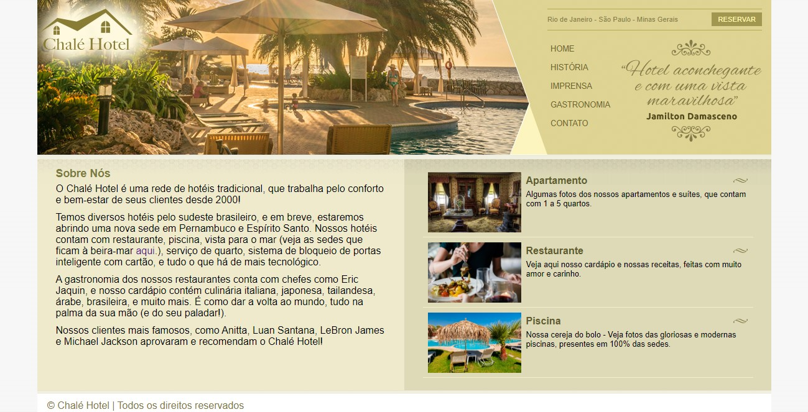
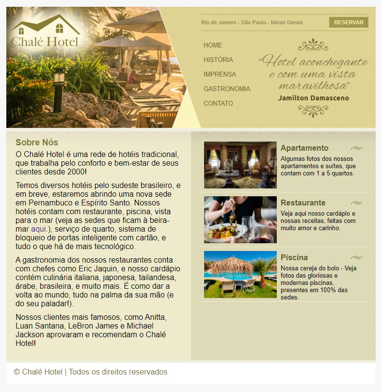

<h1>Curso-Udemy</h1>

<h2>💻 Sobre</h2>

Esse repositório é utilizado para salvar e manter meu progresso no curso de desenvolvedor web da Udemy (https://www.udemy.com/course/web-completo/).
Aqui estão alguns dos últimos projetos que desenvolvi com as aulas:

---

<h2>🏨 Projeto Chalé Hotel</h2>

Consiste em um site de um hotel fictício, 
chamado Chalé Hotel. O layout é fixo, porém
é ajustável horizontalmente, para ser
compatível em diversas resoluções de tela. 

<h3 align="center">Página Inicial:</h3>

 

<h3 align="center">Página Inicial (reduzida)</h3>

Nesse caso, foi especificado um limite mínimo 
de pixels para o site não reduzir muito e quebrar o layout. Esse limite também é aplicado como um
limite máximo, para o site não se estender 
demais.

---

<h2>🔎 Projeto Museu Nacional</h2>

O projeto é sobre o Museu Nacional, que fica na Universidade Federal do Rio de Janeiro (UFRJ). É um sistema que utiliza elementos flutuantes para organização, além de links externos, como o do Google Maps e o Youtube. 

<h3 align="center">Página Inicial:</h3>

